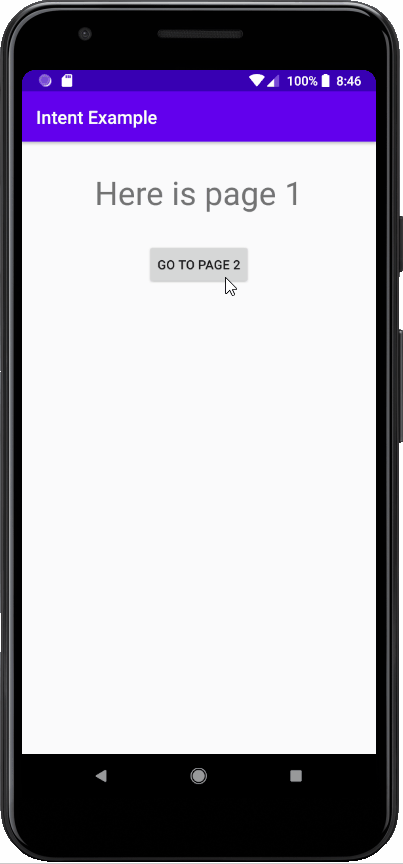

# Android-Intent-Example

Intent ile sayfalar (layout'lar) arası geçiş. / Switching between pages (layouts) with intent



Yeni bir proje oluşturduğumuzda pojemiz bize varsayılan olarak bir ActivityMain.java sınıfını bir de activity_main.xml view’ini veriyor. Bu bizim birinci ekranımız.

İkinci ekranı oluşturmak için öncelikle res klasörünün altında yer alan layout klasörüne sağ tıklıyoruz. New > Layout recourse file diyerek activity_hakkinda adında yeni bir layout oluşturuyoruz.

Ardından java klasörümüzün altında yer alan klasöre sağ tıklayıp New > Java Class diyerek yeni bir HakkindaActivity adında bir java sınıfı oluşturuyoruz.

Sınıfımızı oluşturduktan sonra sınıfın içine girip activity özelliği kazanabilmesi için public class satırına aşağıdaki gibi extends AppCompatActivity yazıyoruz.

```java
public class HakkindaActivity extends AppCompatActivity {
```

Sonra AppCompatActivity yazısının üzerine tıklayıp alt+enter tuşlarına basarak gerekli kütüphanesini import ediyoruz.

Sonrasında public class’in içine tıklayıp alt + insert tuşlarına basarak override methods içerisinden en üstteki onCreate metodunu seçiyoruz.

Bu metodun içerisinde hangi layout’u bağlayacağımızı belirtmek için setContentView(R.layout.activity_hakkinda) diyerek bizim biraz önce oluşturmuş olduğumuz hakkina_activity.xml i işaret ediyoruz.

```java
public class HakkindaActivity extends AppCompatActivity {

    @Override
    protected void onCreate(@Nullable Bundle savedInstanceState) {
        super.onCreate(savedInstanceState);
        setContentView(R.layout.activity_hakkinda);
    }
}
```

Geriye bu activity’i programımıza tanıtmak kalıyor. Bunun için de proje klasörümüzün içindeki manifest klasörünün altında yer alan AndroidManifest.xml içerisine;
```java
<activity android:name=".HakkindaActivity" />
```
kodunu ekleyerek programımıza tanıtmış olduk.

Sırada layoutları düzenleyerek java tarafında sayfalar arasında geçişi sağlayacak kodu yazmaya geldi.

# activity_main.xml

```java
<?xml version="1.0" encoding="utf-8"?>
<androidx.constraintlayout.widget.ConstraintLayout xmlns:android="http://schemas.android.com/apk/res/android"
    xmlns:app="http://schemas.android.com/apk/res-auto"
    xmlns:tools="http://schemas.android.com/tools"
    android:layout_width="match_parent"
    android:layout_height="match_parent"
    tools:context=".MainActivity">

    <TextView
        android:id="@+id/textView"
        android:layout_width="wrap_content"
        android:layout_height="wrap_content"
        android:layout_marginTop="32dp"
        android:text="Here is page 1"
        android:textSize="36sp"
        app:layout_constraintEnd_toEndOf="parent"
        app:layout_constraintStart_toStartOf="parent"
        app:layout_constraintTop_toTopOf="parent" />

    <Button
        android:id="@+id/button_page_1"
        android:layout_width="wrap_content"
        android:layout_height="wrap_content"
        android:layout_marginTop="32dp"
        android:text="Go to page 2"
        app:layout_constraintEnd_toEndOf="parent"
        app:layout_constraintStart_toStartOf="parent"
        app:layout_constraintTop_toBottomOf="@+id/textView" />
</androidx.constraintlayout.widget.ConstraintLayout>
```


# activity_hakkinda.xml

```java
<?xml version="1.0" encoding="utf-8"?>
<androidx.constraintlayout.widget.ConstraintLayout
    xmlns:android="http://schemas.android.com/apk/res/android"
    xmlns:app="http://schemas.android.com/apk/res-auto"
    xmlns:tools="http://schemas.android.com/tools"
    android:layout_width="match_parent"
    android:layout_height="match_parent">

    <TextView
        android:id="@+id/textView2"
        android:layout_width="wrap_content"
        android:layout_height="wrap_content"
        android:layout_marginTop="32dp"
        android:text="Here is page 2"
        android:textSize="36sp"
        app:layout_constraintEnd_toEndOf="parent"
        app:layout_constraintStart_toStartOf="parent"
        app:layout_constraintTop_toTopOf="parent" />

    <Button
        android:id="@+id/button_page_2"
        android:layout_width="wrap_content"
        android:layout_height="wrap_content"
        android:layout_marginTop="32dp"
        android:text="Go to page 1"
        app:layout_constraintEnd_toEndOf="parent"
        app:layout_constraintStart_toStartOf="parent"
        app:layout_constraintTop_toBottomOf="@+id/textView2" />
</androidx.constraintlayout.widget.ConstraintLayout>
```

1. ve 2. sayfalarımızda buton ve textview’ler var. Butonlara java ile erişebilmek için sırasıyla button_page_1 ve button_page_2 id’lerini verdik.

Şimdi MainActivity sınıfımızın içerisinde önce Button dan bir nesne tanımlaması ardından bu nesnemize click özelliği kazandırma işlemini yapacağız. Buttonumuza tıklandığında Intent sınıfından bir nesne türeterek bu nesnemizin içine ikinci layout sınıfımızı yerleştiriyor ve ardından startActivity özelliği kullanarak ikinci ekranımıza geçiş yapmış oluyoruz. Aşağıdaki kodları yazarken herhangi bir yazı kırmızı olursa bu o kütüphanenin olmadığını belirtir. Kırmızı yazının üzerine bir kez tıklayıp alt+enter tuşlarına basarsak sınıfımızın içerisine o gerekli kütüphane otomatik olarak yukarıya eklenecekir.


# MainActivity.java

```java
public class MainActivity extends AppCompatActivity {

    @Override
    protected void onCreate(Bundle savedInstanceState) {
        super.onCreate(savedInstanceState);
        setContentView(R.layout.activity_main);

        Button ilksayfa_butonu = findViewById(R.id.button_page_1); //Nesne İle Button İlişkilendirme
 Yaptık


        //Altta butonumuza tıklama özelliği kazandırıyoruz.
        ilksayfa_butonu.setOnClickListener(new View.OnClickListener() {
            @Override
            public void onClick(View v) {

       //MainActivity.this diyerek bu activity de çalışacağını belirtiyoruz
       Intent intentislemi = new Intent(MainActivity.this, HakkindaActivity.class);


                startActivity(intentislemi);
            }
        });
    }
}
```

Artık 1.sayfadayken “Go to page 2” butonuna bastığımızda bizi 2.sayfaya gönderebiliyor.

Şimdi 2.sayfadan 1.sayfaya dönebilmek için HakkindaActivity.java sınıfımıza gerekli kodları yazalım.


# HakkindaActivity.java

```java
public class HakkindaActivity extends AppCompatActivity {
    @Override
    protected void onCreate(@Nullable Bundle savedInstanceState) {
        super.onCreate(savedInstanceState);
        setContentView(R.layout.activity_hakkinda);

        Button ikincisayfa_butonu = findViewById(R.id.button_page_2); //Nesne İle Button İlişkilendirme Yaptık


        //Altta butonumuza tıklama özelliği kazandırıyoruz.
        ikincisayfa_butonu.setOnClickListener(new View.OnClickListener() {
            @Override
            public void onClick(View v) {

      //HakkindaActivity.this diyerek bu activity de çalışacağını belirtiyoruz
      Intent intentislemi = new Intent(HakkindaActivity.this, MainActivity.class);


                startActivity(intentislemi);
            }
        });
    }
}
```


İşlemimiz bu kadar.
